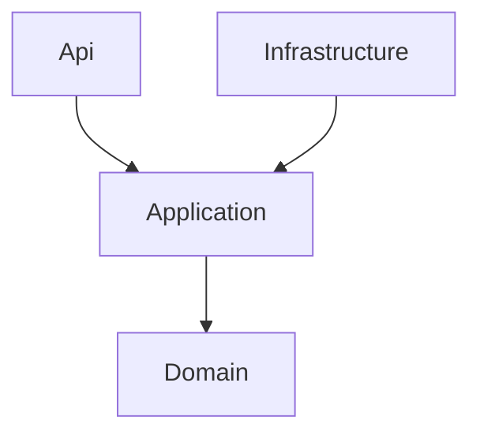

<a name="readme-top"></a>

---
### 📝 So verwendest du dieses Template
Nachdem du dieses Template über den Button **"Use this template"** für dein eigenes Repository übernommen hast, führe folgende Schritte durch:

1.  **Projektnamen anpassen:** Suche im gesamten Projekt nach `AspNetCoreHighPerformanceTemplate` und ersetze es durch den Namen deines Projekts. Dies ist vor allem für die Namespaces und die `.sln`-Datei wichtig.
2.  **Platzhalter ersetzen:**
    *   Suche und ersetze `[DEIN_USER]` mit deinem GitHub-Benutzernamen.
    *   Suche und ersetze `[REPO_NAME]` mit dem Namen deines Repositories.
3.  **README anpassen:** Bearbeite diese `README.md`, um dein spezifisches Projekt zu beschreiben, und lösche diesen Einführungsabschnitt.
---

<br />
<div align="center">
  <a href="https://github.com/[DEIN_USER]/[REPO_NAME]">
   
  </a>

  <h1 align="center">ASP.NET Core High-Performance Template</h1>

  <p align="center">
    <strong>Ein sofort einsatzbereites Template für moderne ASP.NET Core-Anwendungen, basierend auf der Clean Architecture.</strong>
    <br />
    <br />
    <a href="https://github.com/[DEIN_USER]/[REPO_NAME]/issues/new?template=bug_report.md">Bug melden</a>
    ·
    <a href="https://github.com/[DEIN_USER]/[REPO_NAME]/issues/new?template=feature_request.md">Feature anfragen</a>
  </p>
</div>

<div align="center">

[]()
[](https://github.com/[DEIN_USER]/[REPO_NAME]/issues)
[](https://github.com/[DEIN_USER]/[REPO_NAME]/pulls)
[](LICENSE)

</div>

---

<details>
  <summary><strong>📖 Inhaltsverzeichnis</strong></summary>
  <ol>
    <li>
      <a href="#-über-das-projekt">Über das Projekt</a>
      <ul>
        <li><a href="#-architektur">Architektur</a></li>
        <li><a href="#-technologie-stack">Technologie Stack</a></li>
        <li><a href="#-projektstruktur">Projektstruktur</a></li>
      </ul>
    </li>
    <li>
      <a href="#-getting-started">Getting Started</a>
      <ul>
        <li><a href="#voraussetzungen">Voraussetzungen</a></li>
      </ul>
    </li>
    <li><a href="#-entwicklung--commands">Entwicklung & Commands</a></li>
    <li><a href="#-testing--qualitätssicherung">Testing</a></li>
    <li><a href="#-mitwirken">Mitwirken</a></li>
    <li><a href="#-lizenz">Lizenz</a></li>
  </ol>
</details>

---

## 💡 Über das Projekt

Dieses Repository dient als robustes Fundament für neue ASP.NET Core-Projekte. Der Fokus liegt auf hoher Performance, Wartbarkeit und Skalierbarkeit durch die Einhaltung etablierter Design-Prinzipien. Es ist "State of the Art" und zielt auf die jeweils neueste .NET-Version ab.

### 🏛️ Architektur

Das Herzstück des Templates ist die **Clean Architecture**. Diese sorgt für eine strikte Trennung der Belange (Separation of Concerns) und stellt sicher, dass die Geschäftslogik unabhängig von externen Frameworks oder UI-Details bleibt.

Die Abhängigkeitsregel ist strikt: Äußere Schichten dürfen nur auf innere Schichten verweisen.

1.  **`Domain`**: Enthält die Kernlogik, Entitäten, Enums und Interfaces der Business-Domäne. Diese Schicht hat keine Abhängigkeiten zu anderen Schichten.
2.  **`Application`**: Orchestriert die Anwendungsfälle (Use Cases), definiert Interfaces für Repositories und externe Dienste und enthält die Anwendungslogik. Hängt nur von `Domain` ab.
3.  **`Infrastructure`**: Implementiert die in der `Application`-Schicht definierten Interfaces. Hier befinden sich Datenbankzugriffe (z.B. via Entity Framework Core), Anbindungen an externe APIs und andere Infrastruktur-Details. Hängt von `Application` ab.
4.  **`Api`**: Der Einstiegspunkt der Anwendung (ASP.NET Core Web API). Nimmt HTTP-Requests entgegen, leitet sie an die `Application`-Schicht weiter und gibt die Ergebnisse zurück. Hängt von `Application` und `Infrastructure` ab.



### 🛠 Technologie Stack

| Komponente   | Technologie / Bibliothek         | Beschreibung                                     |
| :----------- | :------------------------------- | :----------------------------------------------- |
| **Core**     | .NET 10 (Target) / ASP.NET Core  | Web-Framework für die API                        |
| **Testing**  | xUnit                            | Test-Framework für Unit-Tests                    |
| **Testing**  | FluentAssertions                 | Lesbarere und verständlichere Assertions in Tests|
| **Testing**  | Moq                              | Mocking-Framework zur Isolation von Abhängigkeiten |
| **Build**    | Makefile                         | Standardisierte Skripte für Entwicklungs-Tasks   |
| **CI/CD**    | GitHub Actions                   | Vorbereitet für automatisierte Builds & Tests    |

### 📂 Projektstruktur

```text
[REPO_NAME]/
├── .github/                 # GitHub Konfigurationen
├── docs/                    # Projektdokumentation
├── src/                     # Quellcode
│   ├── Api/                 # ASP.NET Core Web API
│   ├── Application/         # Anwendungslogik & Use Cases
│   ├── Domain/              # Business-Entitäten & Kernlogik
│   └── Infrastructure/      # Datenbank, externe Dienste, etc.
├── tests/                   # Testprojekte
│   └── Application.Tests/   # Unit-Tests für die Application-Schicht
├── .editorconfig            # Coding Style Definitionen
├── .gitignore               # Ignorierte Git-Dateien
├── Makefile                 # Shortcut-Befehle für die Entwicklung
├── AspNetCoreHighPerformanceTemplate.sln # Solution-Datei
└── README.md                # Diese Datei
```
<p align="right">(<a href="#readme-top">zurück nach oben</a>)</p>

---

## 🚀 Getting Started

Folge diesen Schritten, um das Projekt lokal aufzusetzen.

### Voraussetzungen

Stelle sicher, dass folgende Tools auf deinem System installiert sind:
*   **Git**
*   **[.NET SDK](https://dotnet.microsoft.com/download)** (Version 10 oder die jeweils neueste)

### Entwicklung & Commands

Dieses Projekt nutzt ein `Makefile`, um häufige Befehle zu vereinfachen.

| Befehl      | Beschreibung                               | Äquivalenter `dotnet` Befehl                               |
| :---------- | :----------------------------------------- | :--------------------------------------------------------- |
| `make init`   | Stellt alle Projekt-Abhängigkeiten wieder her | `dotnet restore`                                           |
| `make build`  | Kompiliert die gesamte Solution            | `dotnet build`                                             |
| `make run`    | Startet die API im Development-Modus     | `dotnet run --project src/Api/Api.csproj`                  |
| `make test`   | Führt alle Tests aus                       | `dotnet test`                                              |
| `make clean`  | Löscht alle `bin` und `obj` Ordner         | `dotnet clean`                                             |
| `make lint`   | Prüft die Code-Formatierung                | `dotnet format --verify-no-changes`                        |

<p align="right">(<a href="#readme-top">zurück nach oben</a>)</p>

### 🧪 Testing & Qualitätssicherung

Qualitätssicherung ist ein zentraler Bestandteil dieses Templates.

**Unit Tests**
Führe die Unit-Tests aus, um die korrekte Funktionsweise der Anwendungslogik sicherzustellen.
```Bash
make test
```

**Code-Style**
Die Einhaltung des Code-Styles wird durch die `.editorconfig` und den `lint`-Befehl geprüft.
```Bash
make lint
```

<p align="right">(<a href="#readme-top">zurück nach oben</a>)</p>

## 🤝 Mitwirken
Beiträge sind willkommen! Bitte lies die `CONTRIBUTING.md` für Details zum Prozess.

<p align="right">(<a href="#readme-top">zurück nach oben</a>)</p>

## 📄 Lizenz
Veröffentlicht unter der MIT Lizenz. Siehe `LICENSE` für weitere Informationen.

<p align="right">(<a href="#readme-top">zurück nach oben</a>)</p>